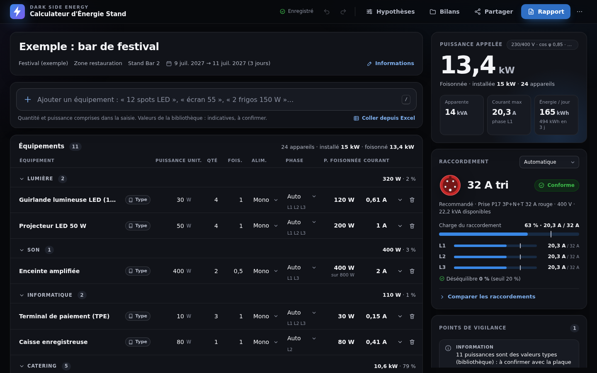

# Calculateur d'Énergie Stand · Dark Side Energy

Bilan de puissance d'un stand ou d'un petit espace événementiel : puissance foisonnée, courant par phase, raccordement recommandé (prises P17), énergie consommée, points de vigilance et rapport imprimable.

L'outil tient dans un seul fichier, `app.html`, sans dépendance externe : il fonctionne hors ligne, depuis un poste, un téléphone ou un site web.



## Ouvrir l'outil

- **Sur un poste** : télécharger `app.html` et l'ouvrir dans un navigateur récent (Chrome, Edge, Firefox, Safari).
- **En ligne** : publier le dépôt avec GitHub Pages (voir « Héberger »), puis ouvrir l'adresse obtenue. L'outil s'installe alors comme une application (écran d'accueil du téléphone, mode hors ligne).

## Ce que fait l'outil

| Fonction | Détail |
|---|---|
| Saisie rapide | « 12 spots LED », « 2 frigos 150 W », « plancha 3 kW » : quantité et puissance reconnues, suggestions de la bibliothèque. |
| Bibliothèque | 107 équipements de stand courants (lumière, vidéo, son, informatique, catering…), catégories alignées sur Darkside Power Plan 2. |
| Tableau éditable | Puissance unitaire, quantité, foisonnement, mono ou tri, phase imposée ou automatique, cos φ et durée par équipement, note. |
| Calculs en direct | Puissance installée et foisonnée, puissance apparente, courant par phase, déséquilibre, taux de charge. |
| Raccordement | Recommandation parmi les prises P17 proposées, comparatif de tous les calibres, vérification d'un raccordement imposé. |
| Énergie | kWh par jour et sur la période, puissance minimale d'une source autonome (groupe ou batterie). |
| Points de vigilance | Surcharge, charge au-delà de l'objectif, déséquilibre, puissances à compléter, valeurs types à confirmer, pièges d'unités, appareils de plus de 16 A. |
| Rapport | Document A4 en six parties : synthèse, données saisies, hypothèses, calculs, recommandations, points à vérifier. Impression ou PDF. |
| Bilans | Plusieurs bilans enregistrés dans le navigateur, duplication, récapitulatif Excel de tous les bilans, sauvegarde complète. |
| Échanges | Fichier du bilan (`.bilan-stand.json`), export CSV pour Excel, collage depuis Excel avec choix des colonnes, lien de partage. |
| Confort | Annuler et rétablir, thème sombre ou clair, mobile, raccourcis clavier (`/`, `Ctrl+K`, `Ctrl+Z`, `?`). |

## Méthode de calcul

| Grandeur | Formule |
|---|---|
| Puissance foisonnée | P = puissance unitaire × quantité × foisonnement |
| Puissance apparente | S = P / cos φ (cos φ de l'équipement, sinon celui du projet) |
| Courant monophasé | I = S / V |
| Courant triphasé, par phase | I = S / (√3 × U) |
| Répartition « Auto » | appareil par appareil, du plus puissant au moins puissant, sur la phase la moins chargée |
| Déséquilibre | (I max − I moyen) / I moyen |
| Taux de charge | I de la phase la plus chargée / calibre du raccordement |
| Raccordement recommandé | plus petit raccordement proposé (par puissance disponible) dont le taux de charge reste sous l'objectif |
| Source autonome | S min = √3 × U × I max / objectif en triphasé, V × I / objectif en monophasé, hors appels au démarrage |
| Énergie | P foisonnée × heures par jour, puis × nombre de jours (dates incluses) |

### Hypothèses par défaut (modifiables pour chaque bilan)

| Hypothèse | Valeur |
|---|---|
| Tensions | 230 V / 400 V |
| cos φ par défaut | 0,85 (valeur par défaut de Darkside Power Plan 2) |
| Taux de charge maximal visé | 80 % |
| Déséquilibre maximal toléré | 20 % |
| Raccordements proposés | 16 A et 32 A mono, 32 A, 63 A et 125 A tri |
| Durée d'utilisation, jours | à renseigner (sinon l'énergie n'est pas calculée) |

### Limites

- Les puissances de la bibliothèque sont des **valeurs types** : elles sont marquées « Type » et signalées à confirmer jusqu'à ce que l'utilisateur les modifie ou les confirme.
- L'outil ne calcule ni les sections de câbles, ni les protections, ni la sélectivité, ni les courants harmoniques dans le neutre : ces points relèvent de l'étude de distribution (Darkside Power Plan 2).
- Au-delà de 125 A, l'outil indique le calibre minimal et renvoie vers une étude spécifique.

## Données

Les bilans sont enregistrés dans le navigateur (stockage local), sur l'appareil utilisé. Rien n'est envoyé sur un serveur, à une exception près : la recherche en ligne, si elle est active, envoie le texte recherché à darkside-energy.com. Pour conserver ou transmettre un bilan : « Enregistrer le fichier du bilan », « Sauvegarde complète » ou « Partager ».

Le lien de partage contient le bilan complet, compressé dans l'adresse : la personne qui l'ouvre obtient sa propre copie.

## Héberger

### GitHub Pages

Dans les paramètres du dépôt : *Settings → Pages → Build and deployment → Deploy from a branch*, branche `main`, dossier `/ (root)`. L'adresse `https://<compte>.github.io/<dépôt>/` ouvre l'outil (`index.html` redirige vers `app.html`). Le service worker (`sw.js`) le rend disponible hors ligne après une première visite.

### Site Wix

Insérer un élément *Intégrer un site* (iframe) pointant vers l'adresse GitHub Pages. Dans une iframe, certains navigateurs bloquent l'impression, le presse-papiers ou le stockage local : l'outil le détecte et propose « Ouvrir dans un nouvel onglet ».

### Recherche en ligne (fonction Wix `searchDevices`)

L'outil interroge `https://www.darkside-energy.com/_functions/searchDevices` en `POST`, corps `{"query": "...", "limit": 5}`, réponse attendue `{"devices": [{"name": "...", "power": 150, "diversity": 1}]}`. Les résultats sont contrôlés (nom en texte brut, puissance positive, foisonnement dans ]0 ; 1]) puis proposés comme valeurs types. Pour fonctionner depuis une autre origine que darkside-energy.com, la fonction doit répondre aux requêtes `OPTIONS` et renvoyer l'en-tête `Access-Control-Allow-Origin`. Si la base ne répond pas, l'outil le signale et continue avec sa bibliothèque locale. Cette liaison n'a pas pu être testée contre le site réel lors du développement : elle est vérifiée par des tests sur un service simulé.

## Développement

```
src/moteur.js       calculs, contrôles, import et export (fonctions pures, testées)
src/catalogue.js    bibliothèque d'équipements types et exemples
src/interface.js    interface
src/page.html       structure de la page
src/styles.css      styles (thèmes sombre et clair, impression)
src/sw.js           service worker
scripts/build.js    assemble app.html et sw.js
tests/              tests unitaires et de bout en bout
```

`app.html` est **généré** : modifier les fichiers de `src/`, puis lancer `npm run build`.

```
npm install          # installe Playwright (tests dans le navigateur)
npm run build        # assemble app.html et sw.js
npm test             # tests unitaires du moteur et de la bibliothèque
npm run test:e2e     # tests de bout en bout dans Chromium
npm run verifier     # tout : fichiers générés à jour, tests unitaires, tests navigateur
```

L'intégration continue (`.github/workflows/verifications.yml`) refuse un `app.html` qui ne correspondrait pas aux sources et relance tous les tests à chaque envoi.

Conventions : code et interface en français ; aucun caractère invisible dans les sources (écrire ` `), vérifié à l'assemblage ; tout texte venant de l'utilisateur ou d'un fichier est inséré en texte brut, jamais en HTML.

## Versions

- **2.0.0** : nouvelle version complète (moteur testé, bibliothèque, raccordements P17, répartition des phases, énergie, rapport, bilans multiples, imports et exports, partage, mobile, hors ligne).
- 1.0 : prototype du calculateur.
